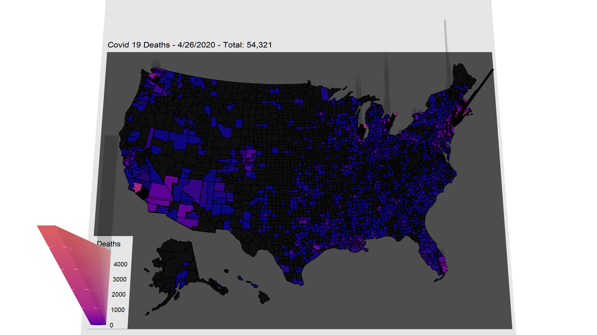

# 3D Map of Covid 19 Deaths in the U.S.
Demo: https://www.youtube.com/watch?v=Ytg8onMecgU

To run, grab `Covid19Map.R` and `cd1.csv`.

Open `Covid19Map.R` in RStudio, install the required packages when prompted, and click Run.

It takes a bit to render the map so give it a few.

You can resize the view window by dragging the corner and then clicking the maximize button.

